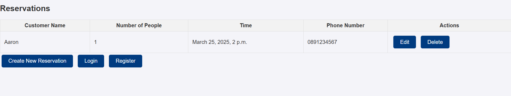
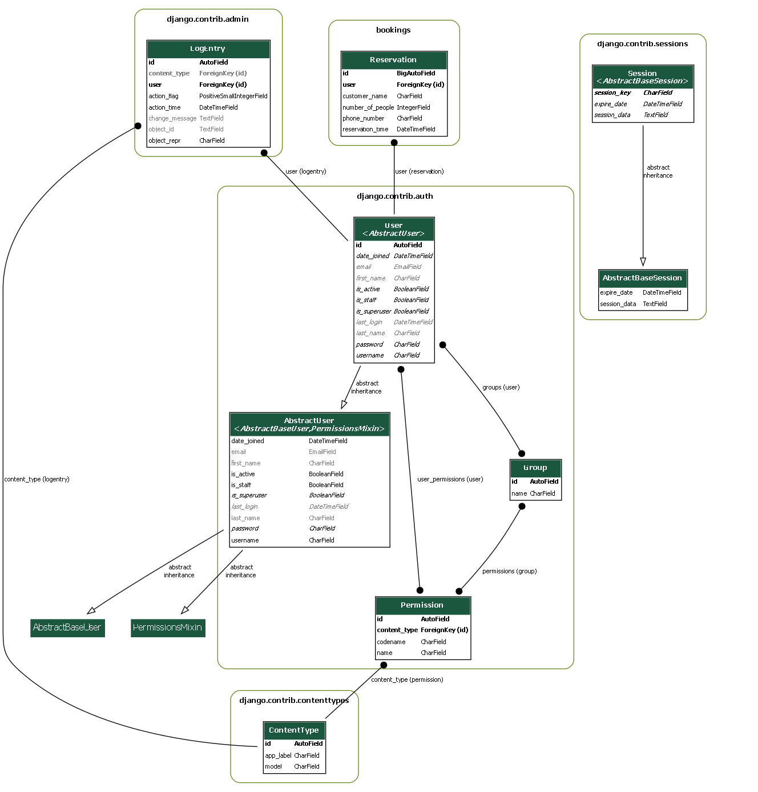

# PP4 - Reservation

# PP4 Reservation

## Overview

This is a simple restaurant booking website made using Python, HTML and PostgreSQL for Portfolio Project 4 of the Code Institute Full Stack Development course.

The deployed app is on https://pp4-reservation-797e3a069ab7.herokuapp.com/.

ER diagram generated using python manage.py graph_models -a -g -o er_diagram.png from django-extensions and Graphviz

## Features

# Create
Users can create a new booking, but only if logged in

# Read
Users can view all bookings whether logged in or not

# Update
Users can update a booking, but only one they made themself. If they attempt to update a booking that is not in their name, they will be notified that they can't do this via a JavaScript alert.

# Delete
Users can delete a booking, but only one they made themself. If they attempt to dleete a booking that is not in their name, they will be notified that they can't do this via a JavaScript alert.

# Login
Users can log in if they have an account, which allows them create, update and delete bookings

# Logout
Users can log out at any time

# Register
Users can register if they don't already have an account

# Future Features
Currently, there are no table numbers, so in the future, I plan to add table numbers to the model and prevent double bookings for tables (i.e. same table, same date/time).
I also plan to have non-admmin users only able to view their own bookings while admin users can still view all bookings.

## Technologies Used

### Languages Used

HTML, CSS, JavaScript, Python

### Database Used

sqlite3 for development, PostgreSQL for deployment on Heroku

## Validation

CSS:
Validated, no errors
https://jigsaw.w3.org/css-validator/validator

HTML:
Validated, no errors apart from Django-specific values not recognized by validator
https://validator.w3.org/nu/#textarea

Python:
Validated using PEP8, no errors found
https://pep8ci.herokuapp.com/

## Testing

Manually tested creating, updating and deleting while logged out
Result: Redirected to login in each case, if logged out can only view bookings

Manually tested form validation:

Name: Must not be empty
Number of guests: Must be a whole number (field type itself enforces this), must be greater than zero
Reservation date/time: Must be a valid date, cannot be in the past (including the current day but a past time on that day)
Phone number: Must be between 8 and 15 digits, can contain + at start, spaces, or dashes, but these are not included in count, must not contain any other characters (e.g. letters)

Manually tested deleting and updating a record not made by user, as a non-admin:
Result: Change was not made, user is alerted that they don't have permission to do that

Manually tested deleting and updating a record not made by user, as an admin:
Result: Change was made, as admin has permission to change or delete any record

Tested responsiveness using Google browser and manually resizing window, all elements are visible in all cases, works across all screen sizes

## Deployment & Local Development

### Deployment
1. Set up Your Project Locally
Ensure that you have the following prerequisites installed on your local machine:

Python (preferably version 3.8 or later)

Django (installed via pip)

Git (for version control and deployment)

Heroku CLI (for interacting with Heroku from the command line)

If you haven’t already, set up your Django project and make sure everything is running smoothly locally.

2. Install Necessary Dependencies
You'll need to install some packages for deploying Django on Heroku. Run the following commands:

pip install gunicorn
pip install psycopg2
pip install dj-database-url
pip install whitenoise
gunicorn is the web server that Heroku uses to run your application.

psycopg2 is required to connect to a PostgreSQL database (used by Heroku).

dj-database-url allows you to configure the database URL from the environment.

whitenoise handles serving static files in production.

3. Create a requirements.txt File
You’ll need to generate a requirements.txt file which lists all your dependencies. Run this command:

pip freeze > requirements.txt
This file is essential for Heroku to install your dependencies.

4. Create a Procfile
Create a file named Procfile in the root of your project (no file extension), and add the following line:

web: gunicorn restaurant_booking_.wsgi
This tells Heroku to use gunicorn to run your Django application.

5. Configure Static Files
Add whitenoise to your MIDDLEWARE in settings.py:

MIDDLEWARE = [
    'whitenoise.middleware.WhiteNoiseMiddleware',
    # other middlewares
]
Also, set up the static files settings:

STATIC_URL = '/static/'

STATICFILES_STORAGE = 'whitenoise.storage.CompressedManifestStaticFilesStorage'
Run collectstatic to gather all static files:

python manage.py collectstatic

6. Configure the Database
Heroku uses PostgreSQL by default. To configure your database:

Install dj-database-url by running pip install dj-database-url.

In settings.py, modify the DATABASES setting:

import dj_database_url

DATABASES = {
    'default': dj_database_url.config(default='postgres://localhost:5432/your_database_name')
}
Heroku automatically sets the DATABASE_URL environment variable for your database. If you're testing locally, you can use the default URL.

7. Set Up the Django Secret Key
To avoid exposing your secret key, you should load it from an environment variable in production:

import os

SECRET_KEY = os.getenv('DJANGO_SECRET_KEY', 'your_default_secret_key')
Then, set the environment variable DJANGO_SECRET_KEY in Heroku later.

8. Push Your Code to GitHub
Before deploying to Heroku, you might want to push your code to GitHub for version control. If you haven’t done that yet, run these commands:

git init
git add .
git commit -m "Initial commit"
git remote add origin your-git-repo-url
git push -u origin master

9. Deploy to Heroku

Log in to Heroku (if not already logged in):
heroku login

Create a new Heroku application:
heroku create your-app-name

Add PostgreSQL to your Heroku app:
heroku addons:create heroku-postgresql:hobby-dev

Push your code to Heroku:
Edit
git push heroku master

10. Migrate the Database
After deployment, run migrations on Heroku:
heroku run python manage.py migrate

11. Set Environment Variables
Set the DJANGO_SECRET_KEY and other necessary environment variables (e.g., DEBUG):
heroku config:set DJANGO_SECRET_KEY='your-unique-secret-key'
heroku config:set DEBUG=False
You can also set any other environment variables you need for production.

12. Open Your App
Once everything is deployed, you can open your app in a browser:
heroku open
This will open the URL of your Heroku app.